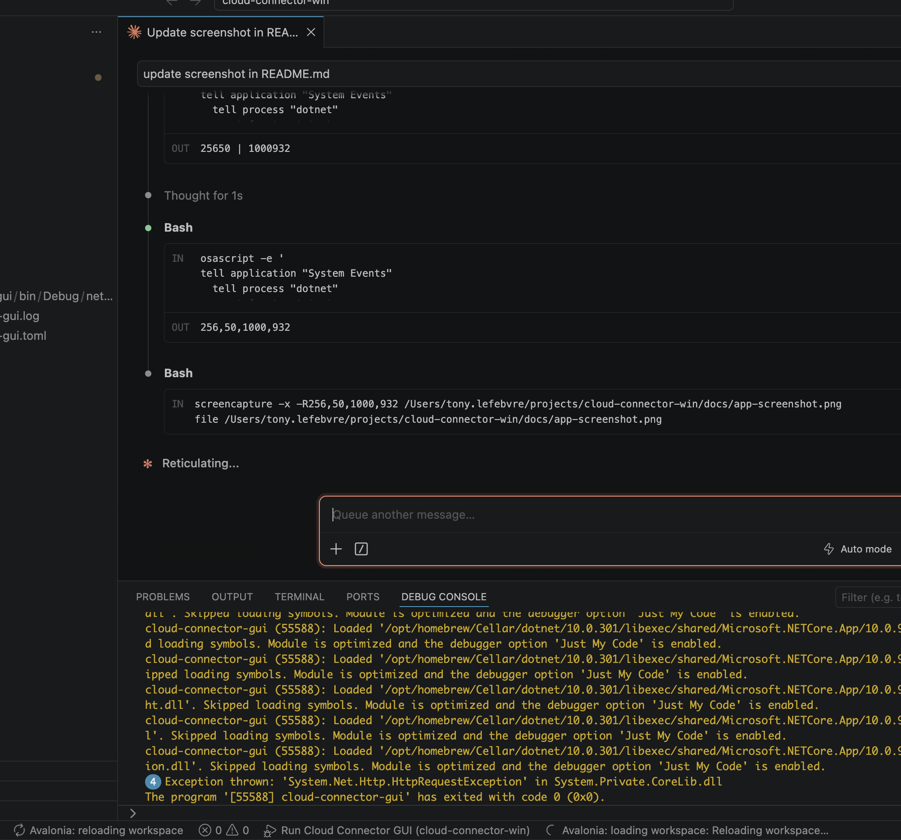

# cloud-connector-gui

A small cross-platform (Windows, macOS, Linux) graphical launcher for the `outsystemscc` connector.



The app helps users build and run this command without typing the raw CLI syntax:

```text
outsystemscc.exe --header "token: <token>" [--proxy <proxy>] [-v] <address> R:<local-port>:<remote-host>:<remote-port>...
```

## Features

- Address and token inputs for the Private Gateway values from ODC Portal.
- TCP endpoint grid with local secure-gateway port, remote host, and remote port.
- Optional proxy and verbose logging.
- Start/Stop controls with live stdout/stderr log capture.
- Downloads the `outsystemscc` binary (Windows, macOS, or Linux, matching the host CPU
  architecture) from stable GitHub releases of
  [`tony4outsystems/cloud-connector`](https://github.com/tony4outsystems/cloud-connector).
- Shows the installed connector version and the latest stable version available on GitHub.
- Manual Download / Update Binary button.

On first start, the app installs the connector binary into the current user's local app data
folder. The launcher uses GitHub release JSON from `/releases`, ignores prereleases, selects the
matching platform/architecture archive, and verifies the release SHA-256 digest when GitHub
provides one.

## Build

Install .NET 10 SDK, then run:

```sh
dotnet test tests/cloud-connector-gui.Core.Tests/cloud-connector-gui.Core.Tests.csproj
dotnet publish src/cloud-connector-gui/cloud-connector-gui.csproj \
  -c Release \
  -r <rid> \
  --self-contained true \
  -o artifacts/<rid>
```

Replace `<rid>` with your target runtime identifier: `win-x64`, `osx-x64`, `osx-arm64`, or
`linux-x64`. The publish command writes the self-contained app to `artifacts/<rid>`. The connector
binary is downloaded by the app at runtime.

## Release

GitHub Actions builds and publishes release packages for Windows, macOS (x64 and arm64), and
Linux when a `v*` tag is pushed:

```sh
git tag v1.0.0
git push origin v1.0.0
```

The workflow can also be run manually from GitHub Actions with a tag name. For each platform it
uploads `cloud-connector-gui-<rid>.zip` (Windows) or `cloud-connector-gui-<rid>.tar.gz` (macOS/Linux)
as both a workflow artifact and a GitHub Release asset.

## Test

```sh
dotnet test tests/cloud-connector-gui.Core.Tests/cloud-connector-gui.Core.Tests.csproj
```
